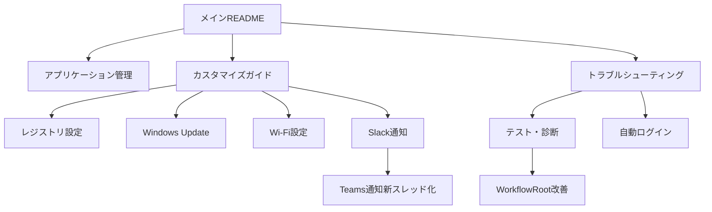

# Windows Kitting Workflow - ドキュメント目次

## 📖 この目次について

このドキュメントは、Windows Kitting Workflowプロジェクトの全ドキュメントを体系的に整理し、目的や経験レベルに応じて適切なドキュメントを見つけられるようにします。

## 🎯 目的別ガイド

### 🚀 はじめて使う方
1. **[メインREADME](../README.md)** - プロジェクト概要とクイックスタート
2. **[トラブルシューティングガイド](Troubleshooting.md)** - 問題発生時の対処法
3. **[アプリケーション管理ガイド](Application-Management.md)** - インストールされるアプリの理解
4. **[Office インストールガイド（ODT 連携）](Office-Installation-Guide.md)** - ODT 構成と実行手順

### ⚙️ カスタマイズしたい方
1. **[カスタマイズガイド](Customization-Guide.md)** - 基本的なカスタマイズ方法
2. **[レジストリ設定ガイド](Registry-Configuration.md)** - システム設定の詳細
3. **[Windows Updateガイド](Windows-Update-Guide.md)** - アップデート設定の詳細
4. **[Wi-Fi設定ガイド](Wi-Fi-Configuration-Guide.md)** - Wi-Fi自動設定
5. **[スタートアップアプリ無効化ガイド](disable_startup_apps_guide.md)** - 指定名のスタートアップ登録を無効化
6. **[ローカルユーザー削除ガイド](remove_user_guide.md)** - ローカルユーザーとプロファイルの削除

### 🔔 通知機能を設定したい方
1. **[共通通知ライブラリ](Common-Notification-Library.md)** - 通知機能の共通化実装
2. **[Slackスレッドガイド](Slack-Thread-Guide.md)** - Slack通知の基本設定
3. **[Teams通知新スレッド化方式ガイド](Teams-Notification-V2-Guide.md)** - Teams通知の新スレッド化方式

### 🧪 テスト・診断を行いたい方
1. **[テスト・診断ガイド](Testing-Guide.md)** - テストツールの使用方法
2. **[トラブルシューティングガイド](Troubleshooting.md)** - 問題の診断と解決

### 🔧 開発・保守担当者
1. **[共通通知ライブラリ](Common-Notification-Library.md)** - 通知機能の共通化アーキテクチャ
2. **[WorkflowRoot改善ガイド](WorkflowRoot-Improvement-Guide.md)** - 共通処理の実装詳細
3. **[Teams通知新スレッド化方式ガイド](Teams-Notification-V2-Guide.md)** - 新スレッド化方式の技術詳細

## 📂 機能別ドキュメント一覧

### 🔧 システム設定・カスタマイズ
| ドキュメント | 対象者 | 内容 |
|-------------|--------|------|
| [WorkflowEditorガイド](WorkflowEditor-Guide.md) | 中級者 | GUIワークフロー設定エディター |
| [レジストリ設定ガイド](Registry-Configuration.md) | 上級者 | レジストリ設定の詳細説明 |
| [アプリケーション管理ガイド](Application-Management.md) | 全ユーザー | アプリインストール管理 |
| [BitLocker設定ガイド](BitLocker-Configuration-Guide.md) | 中級者 | BitLocker暗号化設定 |
| [カスタマイズガイド](Customization-Guide.md) | 中級者 | ワークフローのカスタマイズ |
| [Windows Updateガイド](Windows-Update-Guide.md) | 中級者 | Windows Update設定詳細 |
| [Wi-Fi設定ガイド](Wi-Fi-Configuration-Guide.md) | 中級者 | Wi-Fi自動設定機能 |
| [Office インストールガイド（ODT 連携）](Office-Installation-Guide.md) | 中級者 | ODT 構成・テンプレート置換・実行手順 |
| [スタートアップアプリ無効化ガイド](disable_startup_apps_guide.md) | 中級者 | 指定名のスタートアップ登録を無効化する手順と動作詳細 |
| [ローカルユーザー削除ガイド](remove_user_guide.md) | 管理者 | ローカルユーザーとプロファイルの安全な削除手順 |
| [タスクバー設定ガイド](taskbar_layout_guide.md) | 中級者 | タスクバーのピン留め構成と適用手順 |

### 🔔 通知・連携機能
| ドキュメント | 対象者 | 内容 |
|-------------|--------|------|
| [共通通知ライブラリ](Common-Notification-Library.md) | 開発者 | 通知機能の共通化と統一化 |
| [Slackスレッドガイド](Slack-Thread-Guide.md) | 中級者 | Slack通知機能の詳細 |
| [Teams通知新スレッド化方式ガイド](Teams-Notification-V2-Guide.md) | 開発者 | Teams通知の新スレッド化方式 |

### 🧪 テスト・サポート
| ドキュメント | 対象者 | 内容 |
|-------------|--------|------|
| [テスト・診断ガイド](Testing-Guide.md) | 全ユーザー | テストツールの使用方法 |
| [トラブルシューティングガイド](Troubleshooting.md) | 全ユーザー | 問題解決方法 |

### 🔐 セキュリティ・ファイル配布
| ドキュメント | 対象者 | 内容 |
|-------------|--------|------|
| [自動ログインREADME](AutoLogin-README.md) | 上級者 | 自動ログイン機能詳細 |
| [copy_path_with_network ガイド](copy_path_with_network_guide.md) | 中級者 | 共有コピー、資格情報、{pcname} 展開 |

### 👨‍💻 開発・技術詳細
| ドキュメント | 対象者 | 内容 |
|-------------|--------|------|
| [WorkflowRoot改善ガイド](WorkflowRoot-Improvement-Guide.md) | 開発者 | 共通処理改善の実装 |

## 📈 スキルレベル別推奨順序

### 👶 初心者（Windows管理が初めて）
1. [メインREADME](../README.md) → 2. [アプリケーション管理ガイド](Application-Management.md) → 3. [トラブルシューティングガイド](Troubleshooting.md) → 4. [Office インストールガイド（ODT 連携）](Office-Installation-Guide.md)

### 🎓 中級者（基本的なカスタマイズを行いたい）
1. [カスタマイズガイド](Customization-Guide.md) → 2. [WorkflowEditorガイド](WorkflowEditor-Guide.md) → 3. [Wi-Fi設定ガイド](Wi-Fi-Configuration-Guide.md) → 4. [Slackスレッドガイド](Slack-Thread-Guide.md)

### 🎯 上級者（システム最適化を行いたい）
1. [レジストリ設定ガイド](Registry-Configuration.md) → 2. [Windows Updateガイド](Windows-Update-Guide.md) → 3. [自動ログインREADME](AutoLogin-README.md)

### 👨‍💻 開発者（機能拡張・改修を行いたい）
1. [WorkflowRoot改善ガイド](WorkflowRoot-Improvement-Guide.md) → 2. [Teams通知新スレッド化方式ガイド](Teams-Notification-V2-Guide.md)

## 🔗 ドキュメント間の関連性

## 📋 チェックリスト

### 初回セットアップ時
- [ ] [メインREADME](../README.md)を読んで全体像を把握
- [ ] [アプリケーション管理ガイド](Application-Management.md)でインストールアプリを確認
- [ ] [トラブルシューティングガイド](Troubleshooting.md)を確認
- [ ] 必要に応じて[カスタマイズガイド](Customization-Guide.md)を参照
 - [ ] 必要に応じて[Office インストールガイド（ODT 連携）](Office-Installation-Guide.md)を参照

### カスタマイズ時
- [ ] [カスタマイズガイド](Customization-Guide.md)で基本方法を理解
- [ ] 必要な機能別ガイドを参照（レジストリ、Wi-Fi、通知など）
- [ ] [テスト・診断ガイド](Testing-Guide.md)でテスト実行

### 問題発生時
- [ ] [トラブルシューティングガイド](Troubleshooting.md)で解決方法を確認
- [ ] [テスト・診断ガイド](Testing-Guide.md)で診断実行
- [ ] 関連する機能別ガイドを確認

## 📞 サポート

- **GitHub Issues**: バグ報告や機能要求
- **ドキュメント改善**: プルリクエストを歓迎します
- **質問**: GitHubのDiscussionsをご利用ください

---

最終更新: 2025年6月16日
